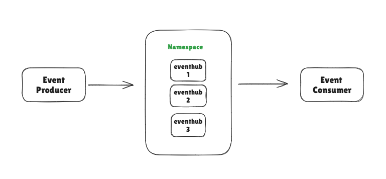

Event Hub Basics :

- EVENT PRODUCER : The Producers of Events which send the data to Event-Hub.Example Kinesis Data Streams,Kafka,etc.

- EVENT CONSUMER : The Consumers of Events which consume the data.Example : EventStream.

- NAMESPACE : The Logical Grouping of Event-Hubs in Azure Cloud.Namespace can have mulitple Event-Hub.

