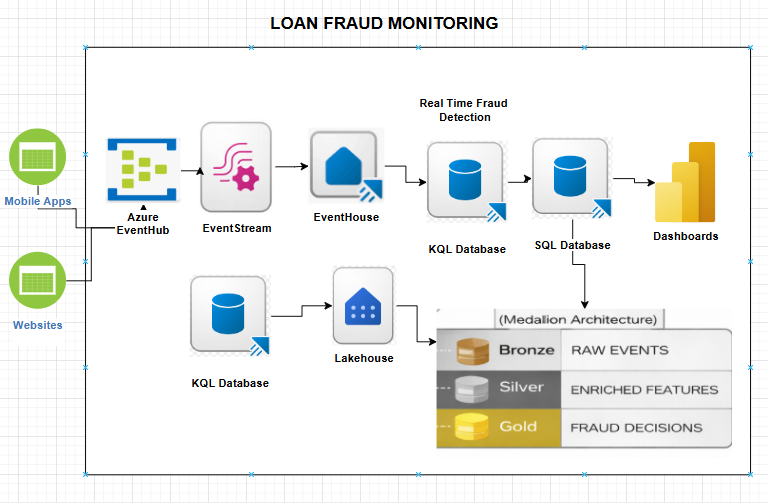
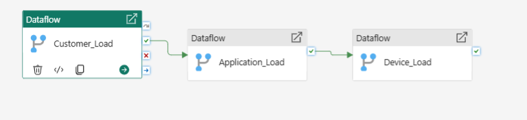
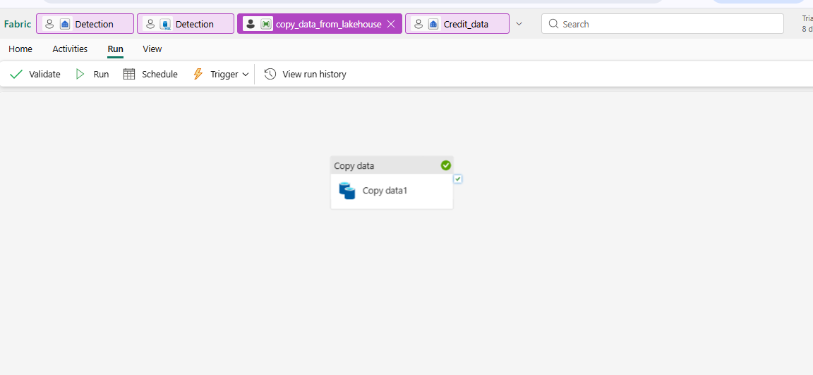
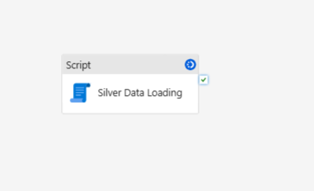
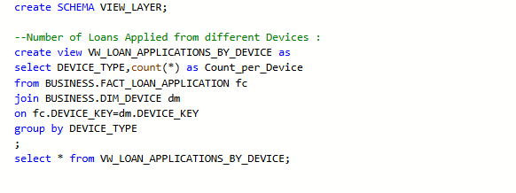
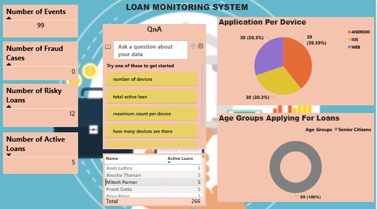

# Loan Fraud Monitoring 

# Scenario :
- Banks gets the Applications for various types of loans(home,vehicle,personal,etc).
- Banks get this data at a realtime basis and they need to analyze the how many of the request are genuine and how many are fraud.
- Then create a report and present it to higher management for business actions.

# Architecture :

# Data Model :

# Data Flow :

# - KQL Database -> Fabric Database(RAW) : Dataflow automated by Data Pipeline.

# Credit Info : Daily Load from External csv file stored in Lakehouse : use of copy data to load CIBIL Data.

# - Fabric Database(RAW) -> Fabric Database(SILVER) : Scripts using Data Pipeline.

# - Fabric Database(SILVER) -> Fabric Database(GOLD) : View Layer .

# POWER BI REPORT
